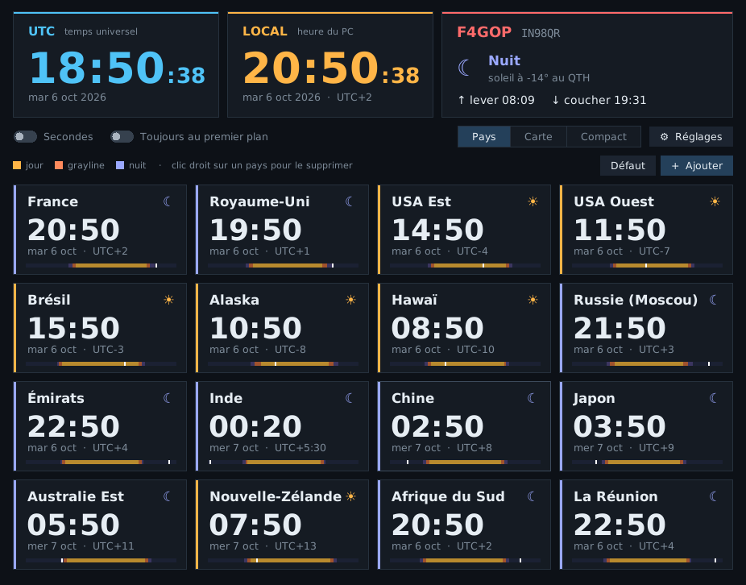
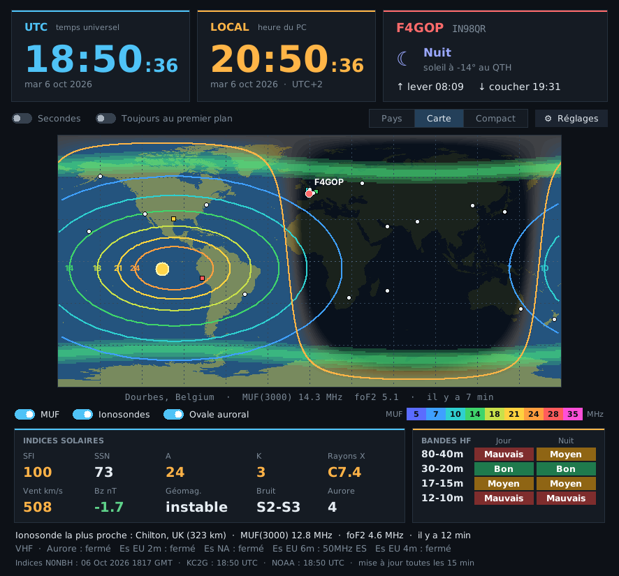
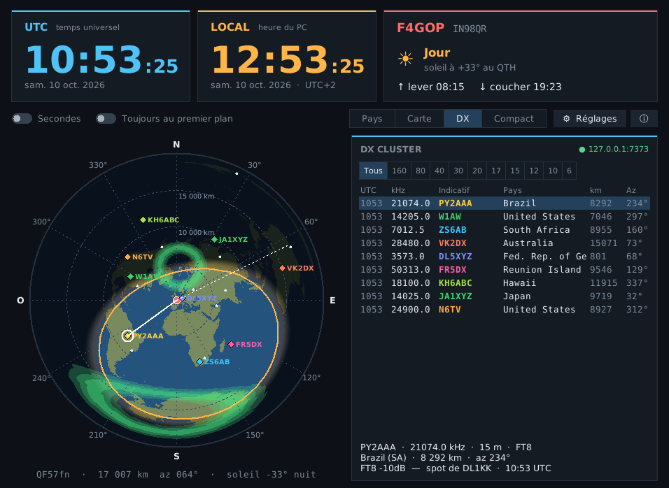

# Horloge mondiale F4GOP

🇬🇧 [English version](README.md)

Horloge mondiale pour la station radioamateur, sur PC Windows : heure UTC et locale,
fuseaux des pays, carte grayline et conditions de propagation HF en direct.

**Disponible en 6 langues :** français, English, Español, Deutsch, Italiano, Português
(détectée automatiquement d'après Windows, modifiable dans ⚙ Réglages).

## Fonctions

- **UTC et heure locale** en grand, avec le lever et le coucher du soleil au QTH.
- **Pays du monde** : heure, date et décalage UTC. Chaque carte montre si le pays est
  en jour, en grayline ou en nuit (calcul solaire réel) et une barre jour/nuit sur 24 h.
  Ajout par recherche (« italie », « canada »…), suppression par clic droit.
- **Carte grayline** : jour/nuit, terminateur, QTH et pays affichés. Au survol :
  locator, distance, azimut depuis le QTH et hauteur du soleil.
- **Propagation** (mise à jour toutes les 15 min) :
  - courbes de **MUF(3000)** et mesures des **ionosondes** ;
  - **ovale auroral** ;
  - **indices** SFI, SSN, A, K, rayons X, vent solaire, Bz, géomagnétisme, bruit ;
  - **bandes HF** jour/nuit et conditions **VHF** (Es, aurore) ;
  - MUF de l'ionosonde la plus proche du QTH.
- **DX cluster** (nouveau en 1.3) : spots DX en direct reçus par telnet (connexion avec ton
  indicatif), affichés sur les cartes et dans une liste avec fréquence, pays, distance et azimut ;
  filtre par bande.
- **Carte azimutale centrée sur le QTH** (nouveau en 1.3) : direction et distance réelles de chaque
  spot et pays, cercles de distance, grayline. Un clic sur un spot trace son trajet grand cercle.
- **Mode compact** : petite bande UTC toujours au premier plan, déplaçable.
- **Démarrage avec Windows** (option dans les réglages).

*Capture réalisée avec des données de propagation simulées.*

## Installation

### Le plus simple : l'exécutable

**[⬇ Télécharger HorlogeMondiale.exe](https://github.com/f4gopdenis-cyber/horloge-mondiale/releases/latest/download/HorlogeMondiale.exe)**
(dernière version), puis le lancer. Rien d'autre à installer.

Toutes les versions : [page des Releases](https://github.com/f4gopdenis-cyber/horloge-mondiale/releases)

> **Note :** au premier lancement, Windows peut afficher « Windows a protégé votre
> ordinateur » (SmartScreen), car l'exécutable n'est pas signé. Cliquer sur
> **Informations complémentaires** puis **Exécuter quand même**. Le code source
> complet est disponible dans ce dépôt, et l'exécutable est compilé automatiquement
> par GitHub Actions à partir de ce code.

### Depuis le code Python

Python 3.9 ou plus récent. Sous Windows :

    py -m pip install tzdata
    py horloge_mondiale.py

Le module `tzdata` est installé automatiquement au premier lancement s'il manque.
Renommer le fichier en `horloge_mondiale.pyw` évite la fenêtre console.

### Construire l'exécutable soi-même

Double-cliquer sur `construire_exe.bat` (installe PyInstaller et produit
`HorlogeMondiale.exe`).

## Premier lancement

La fenêtre **⚙ Réglages** s'ouvre automatiquement : choisir la langue, puis indiquer
son **indicatif** et son **locator**. Ils servent au panneau QTH, aux distances/azimuts,
à la carte azimutale, au choix de l'ionosonde la plus proche et à la connexion au DX cluster.
Le serveur du cluster se change dans les réglages (par défaut `ea4rch.dxfun.com:8000`, avec bascule automatique sur F5MZN, N8DXE, WA9PIE et VE7CC).

Les réglages sont enregistrés dans `horloge_mondiale.json`, dans le dossier utilisateur.

## Sources des données

- Indices solaires et conditions de bandes : [N0NBH — hamqsl.com](https://www.hamqsl.com/solar.html)
- MUF et ionosondes : [KC2G — prop.kc2g.com](https://prop.kc2g.com/) (données GIRO)
- Ovale auroral : [NOAA SWPC — modèle OVATION](https://www.swpc.noaa.gov/products/aurora-30-minute-forecast)
- Préfixes DXCC : [fichiers pays d'AD1C — cty.dat](https://www.country-files.com/)
- Spots DX : réseau DX cluster (nœuds EA4RCH, F5MZN, N8DXE, WA9PIE, VE7CC)
- Contours des terres : paquet Python `global-land-mask` (données NOAA GLOBE)
- Noms des pays, jours et mois : Unicode CLDR

Merci à ces services de mettre leurs données à disposition de la communauté.

## Licence

MIT — voir [LICENSE](LICENSE).

73 de F4GOP
