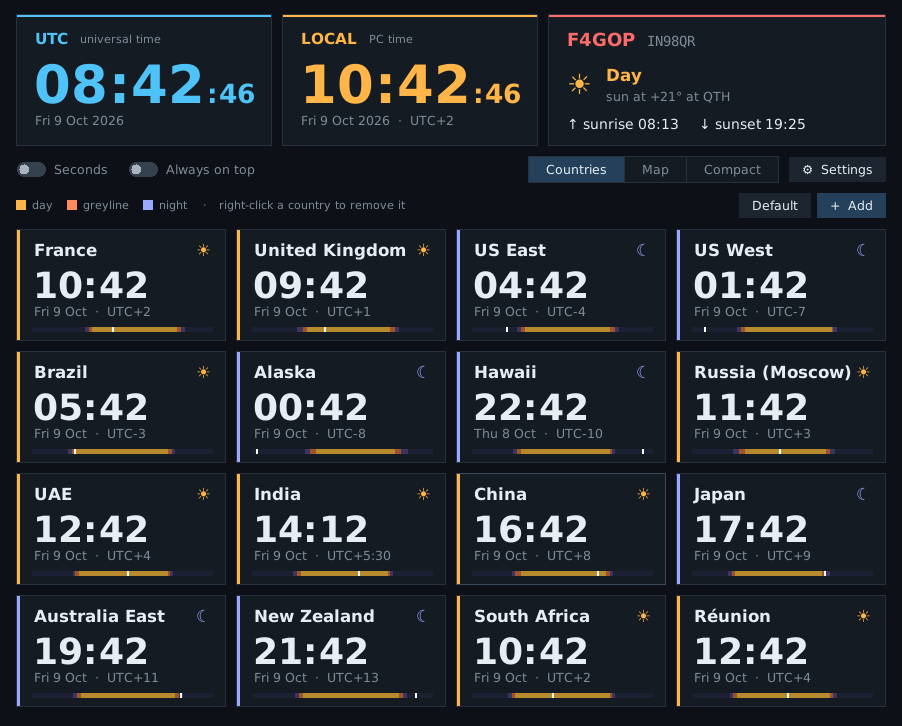
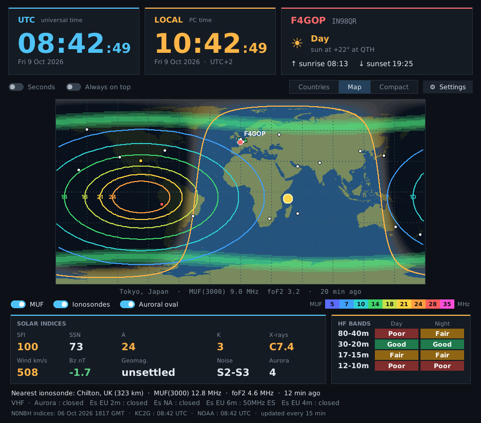
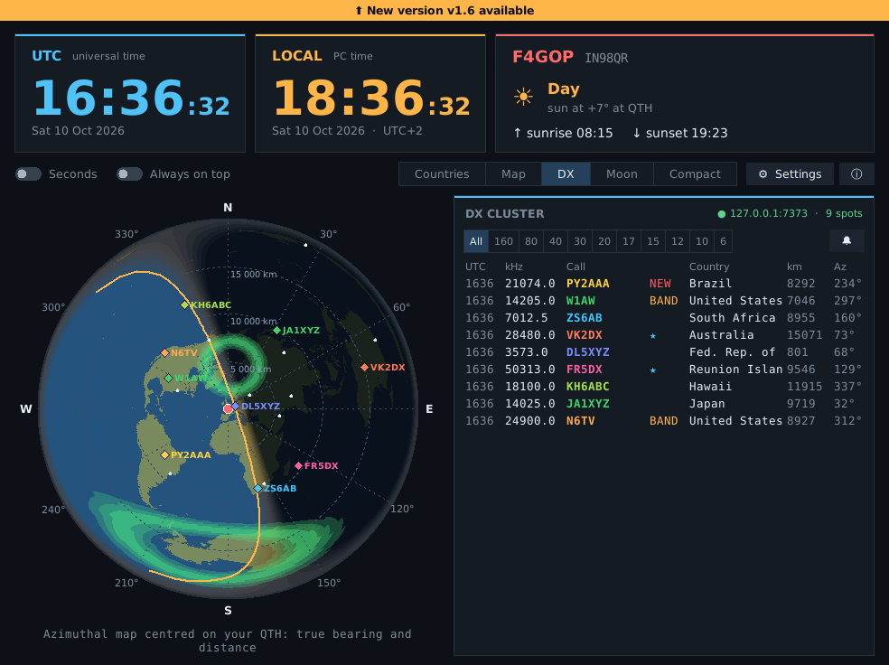
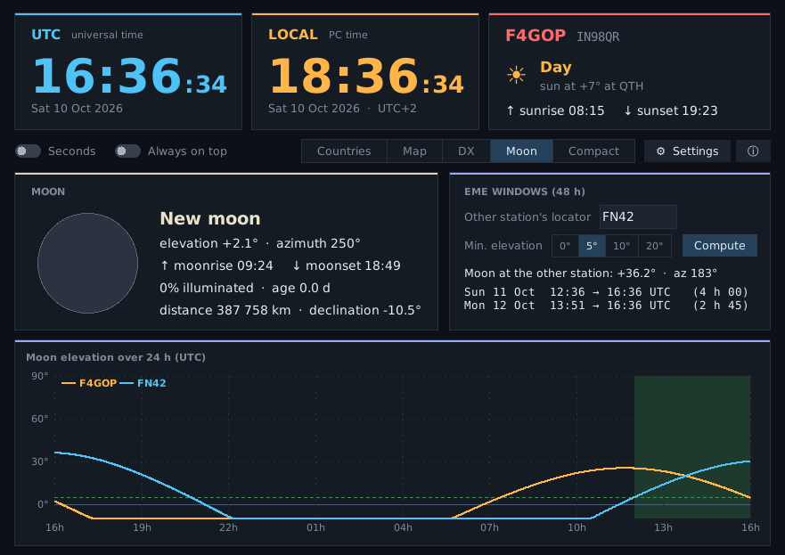

# World Clock F4GOP

🇫🇷 [Version française](README.fr.md)

World clock for the amateur radio shack, for Windows PCs: UTC and local time,
country time zones, greyline map and live HF propagation conditions.

**Available in 6 languages:** English, Français, Español, Deutsch, Italiano, Português
(detected automatically from Windows, can be changed in ⚙ Settings).

## Features

- **UTC and local time** in large digits, with sunrise and sunset at your QTH.
- **Countries of the world**: time, date and UTC offset. Each card shows whether the
  country is in daylight, greyline or night (real solar calculation) and a 24 h
  day/night bar. Add countries by searching ("italy", "canada"…), remove with a right-click.
- **Greyline map**: day/night, terminator, QTH and countries. On hover: locator,
  distance, bearing from your QTH and sun elevation.
- **Propagation** (refreshed every 15 min):
  - **MUF(3000)** contours and **ionosonde** readings;
  - **auroral oval**;
  - **indices**: SFI, SSN, A, K, X-rays, solar wind, Bz, geomagnetic field, noise;
  - **HF band conditions** day/night and **VHF** conditions (Es, aurora);
  - MUF of the ionosonde nearest to your QTH.
- **DX cluster** (new in 1.3): live DX spots received over telnet (your callsign is used to log in),
  shown on the maps and in a list with frequency, country, distance and bearing; band filter.
- **Azimuthal map centred on your QTH** (new in 1.3): true bearing and distance to every spot
  and country, distance rings, greyline. Click a spot to draw its great-circle path.
- **DX alerts** (new in 1.5): sound and pop-up when a watched callsign, prefix or country is
  spotted, or a DXCC entity you have never worked (or a new band) shows up.
- **Missing entities from your log** (new in 1.5): import your ADIF log; spots are tagged
  **NEW** (never worked) or **BAND** (new band). The log is re-read automatically when your
  logging software updates it.
- **Moon / EME** (new in 1.5): Moon phase, elevation and azimuth at your QTH, moonrise/set,
  distance; common EME windows with another locator over 48 h, with a 24 h elevation chart.
- **Update notice** (new in 1.5): a banner appears when a new version is published on GitHub.
- **Radio and rotator control** (new in 1.6): double-click a spot to tune the radio
  (frequency and mode) and turn the antenna to the DX bearing. The radio is reached through your
  logger's CAT sharing in **Hamlib NET rigctl** (OpsLog, Log4OM…, default `127.0.0.1:4532`), so
  there is no COM port conflict. Rotator via **PST Rotator** UDP (`127.0.0.1:12000`) or directly
  through a **GS-232A** TCP controller.
- **DX panel views** (new in 2.0): **Spots**, **Activity** (spots per band and DX continent over
  the last 30 minutes) and **Contests** (this week's contests from the WA7BNM calendar, running
  ones highlighted with time left).
- **Mode and skimmer filters** (new in 2.0): All / CW / Digi / Phone, and CW Skimmer (RBN) spots
  shown, hidden or limited to ≥ 10 dB.
- **Display size** (new in 2.0): 100 %, 125 % or 150 % for large station screens
  (since 2.4 the window always fits the screen: the maps shrink a little if needed).
- **Longer spot list** (new in 2.5): the list fills the available height — enlarge the window
  or go full screen to see more spots at once.
- **Full screen** (new in 2.3): maximize the window (or press F11, Esc to leave) and the whole
  display grows to fill the screen; it returns to normal size when restored.
- **Quick QSO logging** (new in 2.2): selecting a spot pre-fills call, frequency, mode and
  reports; press Enter to log (QSO start and end times recorded since 2.3). QSOs are appended to an ADIF file (set in ⚙ Settings) that your
  logger can import automatically (e.g. OpsLog's "ADIF monitor"). The spot's NEW/BAND tag is
  updated at once. Optional direct upload to the **QRZ.com logbook** (API key, QRZ subscription
  required).
- **Compact mode**: small always-on-top UTC strip you can move anywhere.
- **Start with Windows** (option in the settings).

*Screenshot taken with simulated propagation data.*

## Installation

### Easiest: the executable

**[⬇ Download HorlogeMondiale.exe](https://github.com/f4gopdenis-cyber/horloge-mondiale/releases/latest/download/HorlogeMondiale.exe)**
(latest version), then run it. Nothing else to install.

All versions: [Releases page](https://github.com/f4gopdenis-cyber/horloge-mondiale/releases)

> **Note:** on first launch, Windows may show "Windows protected your PC"
> (SmartScreen) because the executable is not code-signed. Click **More info**, then
> **Run anyway**. The full source code is in this repository, and the executable is
> built automatically by GitHub Actions from this code.

### From the Python source

Python 3.9 or later. On Windows:

    py -m pip install tzdata
    py horloge_mondiale.py

`tzdata` is installed automatically on first launch if it is missing.
Renaming the file to `horloge_mondiale.pyw` avoids the console window.

## First launch

The **⚙ Settings** window opens automatically: choose your language and enter your
**callsign** and **locator**. They are used for the QTH panel, distances/bearings, the
azimuthal map, the nearest ionosonde and the DX cluster login. The DX cluster server can be
changed in the settings (by default it connects to EA4RCH, F5MZN, N8DXE, WA9PIE and VE7CC **simultaneously** for the fastest spots; duplicates are merged).

Settings are saved in `horloge_mondiale.json`, in your user folder.

## Data sources

- Solar indices and band conditions: [N0NBH — hamqsl.com](https://www.hamqsl.com/solar.html)
- MUF and ionosondes: [KC2G — prop.kc2g.com](https://prop.kc2g.com/) (GIRO data)
- Auroral oval: [NOAA SWPC — OVATION model](https://www.swpc.noaa.gov/products/aurora-30-minute-forecast)
- DXCC prefixes: [AD1C country files — cty.dat](https://www.country-files.com/)
- DX spots: DX cluster network (EA4RCH, F5MZN, N8DXE, WA9PIE, VE7CC nodes)
- Contest calendar: [WA7BNM Contest Calendar](https://www.contestcalendar.com/)
- Land outlines: `global-land-mask` Python package (NOAA GLOBE data)
- Country, day and month names: Unicode CLDR

Many thanks to these services for sharing their data with the community.

## License

MIT — see [LICENSE](LICENSE).

73 de F4GOP
